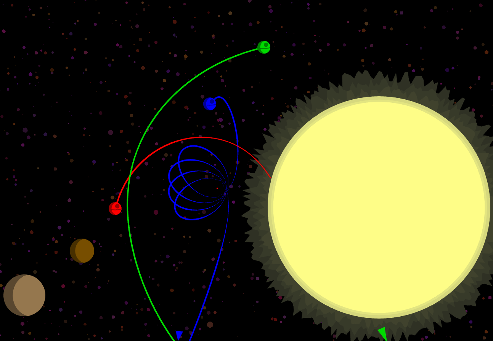

# Death Star Battles



A modern JavaScript/PhaserJS port of the 2001 game **Death Star Battles**, originally created by Ian Bollard. Take control of your own space station, adjust the angle and power of your shots, and fire at your opponents. Use the gravitational pull of nearby stars and planets to your advantage, and when things get too close for comfort, activate hyperspace to jump to a random location. The last surviving station wins. Play the live version [here!](https://deathstarbattles.ca/)

## Features

- Turn-based gameplay inspired by the original **Death Star Battles**.
- Interactive controls to adjust firing angle and power.
- Gravity effects from stars and planets.
- Hyperspace function to escape tight situations.
- Built with modern web technologies: **React**, **TypeScript**, and **Phaser**.

## Tech Stack

- **Phaser**: 2D game engine for rendering and physics.
- **React**: For managing UI components and controls.
- **TypeScript**: For type safety and maintainable code.

## Installation

```sh
git clone https://github.com/yourusername/death-star-battles.git
cd death-star-battles
yarn
```

## Usage

To run a local development version:

```sh
yarn dev
```

This will launch a local server and open the game in your browser.

## License

This project is licensed under the [ISC License](LICENSE).

## Credits

- Original concept and Java version by **Ian Bollard** from [the old Death Star Battles website](https://deathstarbattles.co.uk).
- Ported and modernized using React, TypeScript, and Phaser.

## Contribution

Currently, there are no specific contribution guidelines. Fork & riff as you see fit.